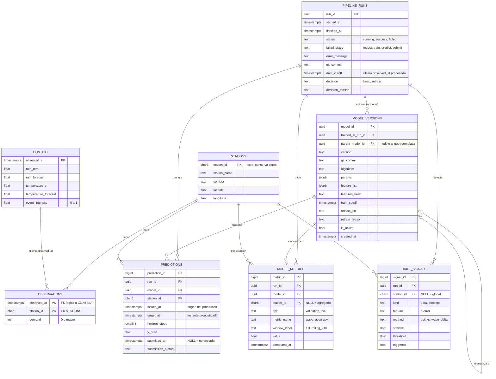

# Modelo de datos

Dos bloques: **datos del reto** (lo que entrega la API, solo lectura) y
**trazabilidad MLOps** (lo que cada equipo persiste, por ejemplo en Supabase).

## Diagrama entidad-relación



Las tablas de datos del reto se mantienen tal cual las entrega la API. El
error real de una predicción **no se guarda**: se obtiene uniendo
`predictions.(station_id, target_at)` con `observations.(station_id, observed_at)`.

## Revisión del diseño

### Datos del reto: verificado sobre `data/*.csv`

| Comprobación | Resultado |
|---|---|
| Nulos en las 3 tablas | 0 |
| Duplicados en PK de `observations` (`observed_at`, `station_id`) | 0 |
| Duplicados en `context.observed_at` / `stations.station_id` | 0 / 0 |
| Observaciones con estación inexistente | 0 |
| `context.observed_at` = `observations.observed_at` (mismo conjunto) | sí |
| `demand` | entero, mínimo 14 (no hay negativos) |

Observaciones de diseño:

1. **`station_id` debe ser texto** (`char(5)`), nunca entero: `02300`, `03000`
   pierden el cero. Ya lo advierte `docs/api.md`.
2. **`observed_at` debe ser `timestamptz`**. Los CSV traen `-05:00`
   (America/Bogotá); un `timestamp` sin zona rompe los joins y el cursor.
3. **La relación con `context` es lógica, no una FK física.** `context` no tiene
   nada que referenciar por estación; se une por `observed_at`. Poner una FK real
   exigiría insertar `context` antes que `observations` en cada ingesta
   incremental. Recomendación: sin FK, con un chequeo de cobertura en la ingesta.
4. **`corridor` está repetido** por estación y no es 3FN estricta (Usme figura
   como `Caracas`). Con 12 filas y sin ninguna necesidad de editar corredores,
   normalizarlo en una tabla aparte añade un join sin ganancia. Se deja como
   atributo.
5. **Riesgo de fuga de información con los pronósticos:**
   `rain_forecast` y `temperature_forecast` vienen alineados a `observed_at` y no
   traen cuándo se emitieron. Al construir features, usar el pronóstico de `t`
   para predecir `t` es válido solo si estaba disponible en el origen `issued_at`.
   Documentarlo en `features.py`; el esquema no puede garantizarlo.
6. **Índice necesario:** la PK (`observed_at`, `station_id`) sirve para rangos de
   tiempo pero no para "una estación, últimos N periodos". Agregar un índice
   (`station_id`, `observed_at`).

### Tablas MLOps: decisiones y por qué

- **`pipeline_runs`** cubre "registrar éxito o error" y el cursor
  (`data_cutoff`). No hay tabla de errores aparte: `failed_stage` +
  `error_message` bastan; si luego se quiere más detalle, se agrega.
- **`model_versions`** cubre "versión o commit, features, cutoff, momento y razón
  del reentrenamiento". `parent_model_id` da el historial de reemplazos y
  `is_active` marca el modelo vigente.
- **`predictions`** tiene una fila por (modelo, estación, `issued_at`,
  `target_at`). Se separa `issued_at` de `target_at` para poder reconstruir el
  horizonte y evitar comparar contra el dato equivocado.
- **`model_metrics`** en formato largo (`metric_name`, `window_label`, `value`)
  para sumar WAPE, accuracy o rolling 24h sin cambiar el esquema.
  `station_id NULL` es la métrica agregada.
- **`drift_signals`** guarda tanto la señal como el umbral, así la decisión de
  reentrenar se puede auditar después.

### Cosas que dejé abiertas (no las sé)

- **Los "cuatro horizontes"**: el README dice que se piden cuatro pero no cuáles.
  Por eso `horizon_steps` es `smallint` y no un enum. Cuando se publique el
  contrato de submissions hay que ajustar el `CHECK`.
- **Formato de submission y leaderboard**: no está publicado. `submission_status`
  es texto libre por ahora; la posición en el leaderboard no tiene tabla.

## DDL (PostgreSQL / Supabase)

```sql
-- Datos del reto ------------------------------------------------------------
create table stations (
  station_id   char(5) primary key,
  station_name text not null,
  corridor     text not null,
  latitude     double precision not null check (latitude  between -90  and 90),
  longitude    double precision not null check (longitude between -180 and 180)
);

create table context (
  observed_at          timestamptz primary key,
  rain_mm              double precision not null check (rain_mm >= 0),
  rain_forecast        double precision not null check (rain_forecast >= 0),
  temperature_c        double precision not null,
  temperature_forecast double precision not null,
  event_intensity      double precision not null check (event_intensity between 0 and 1)
);

create table observations (
  observed_at timestamptz not null,
  station_id  char(5)     not null references stations(station_id),
  demand      integer     not null check (demand >= 0),
  primary key (observed_at, station_id)
);
create index observations_station_time_idx on observations (station_id, observed_at);

-- Trazabilidad MLOps --------------------------------------------------------
create table pipeline_runs (
  run_id          uuid primary key default gen_random_uuid(),
  started_at      timestamptz not null default now(),
  finished_at     timestamptz,
  status          text not null default 'running'
                    check (status in ('running','success','failed')),
  failed_stage    text check (failed_stage in ('ingest','train','predict','submit')),
  error_message   text,
  git_commit      text not null,
  data_cutoff     timestamptz,
  decision        text check (decision in ('keep','retrain')),
  decision_reason text,
  check (status <> 'failed' or failed_stage is not null)
);

create table model_versions (
  model_id          uuid primary key default gen_random_uuid(),
  trained_in_run_id uuid references pipeline_runs(run_id),
  parent_model_id   uuid references model_versions(model_id),
  version           text not null unique,
  git_commit        text not null,
  algorithm         text not null,
  params            jsonb not null default '{}',
  feature_list      jsonb not null,
  features_hash     text not null,
  train_cutoff      timestamptz not null,
  artifact_uri      text,
  retrain_reason    text,
  is_active         boolean not null default false,
  created_at        timestamptz not null default now()
);
-- a lo sumo un modelo activo
create unique index one_active_model on model_versions (is_active) where is_active;

create table model_metrics (
  metric_id    bigint generated always as identity primary key,
  run_id       uuid not null references pipeline_runs(run_id),
  model_id     uuid not null references model_versions(model_id),
  station_id   char(5) references stations(station_id),   -- NULL = agregado
  split        text not null check (split in ('validation','live')),
  metric_name  text not null,
  window_label text not null,
  value        double precision not null,
  computed_at  timestamptz not null default now()
);
create index model_metrics_model_idx on model_metrics (model_id, metric_name, computed_at);

create table predictions (
  prediction_id     bigint generated always as identity primary key,
  run_id            uuid not null references pipeline_runs(run_id),
  model_id          uuid not null references model_versions(model_id),
  station_id        char(5) not null references stations(station_id),
  issued_at         timestamptz not null,
  target_at         timestamptz not null,
  horizon_steps     smallint not null check (horizon_steps > 0),
  y_pred            double precision not null check (y_pred >= 0),
  submitted_at      timestamptz,
  submission_status text,
  check (target_at > issued_at),
  unique (model_id, station_id, issued_at, target_at)
);
create index predictions_target_idx on predictions (station_id, target_at);

create table drift_signals (
  signal_id  bigint generated always as identity primary key,
  run_id     uuid not null references pipeline_runs(run_id),
  station_id char(5) references stations(station_id),    -- NULL = global
  kind       text not null check (kind in ('data','concept')),
  feature    text not null,
  method     text not null,
  statistic  double precision not null,
  threshold  double precision not null,
  triggered  boolean not null
);

-- Supabase: activar RLS y escribir solo desde el pipeline con la service key
-- (guardada como secret de GitHub, nunca en el navegador).
alter table pipeline_runs  enable row level security;
alter table model_versions enable row level security;
alter table model_metrics  enable row level security;
alter table predictions    enable row level security;
alter table drift_signals  enable row level security;
```
